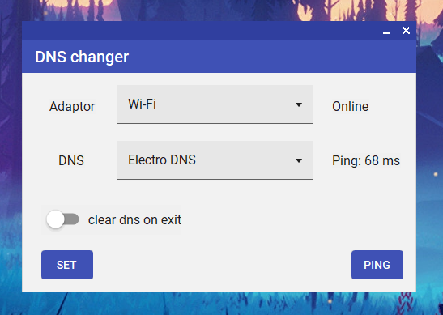

# dnsChanger

A simple Windows desktop application to quickly change the DNS servers of your network adapters. Built with C# (.NET Framework 4.7.2) and MaterialSkin for a modern UI.

## Features

- **List all active network adapters**  
  Easily select which adapter to configure.

- **Choose from popular DNS providers**  
  Includes Google, Cloudflare, Quad9, OpenDNS, AdGuard, Shecan, Electro DNS, RadarGame, 403.online, or revert to Automatic (DHCP).

- **DNS List Table**

  | Name             | Primary DNS        | Secondary DNS        |
  |------------------|-------------------|----------------------|
  | Automatic (DHCP) | *(from DHCP)*     | *(from DHCP)*        |
  | Google           | 8.8.8.8           | 8.8.4.4              |
  | Cloudflare       | 1.1.1.1           | 1.0.0.1              |
  | Quad9            | 9.9.9.9           | 149.112.112.112      |
  | OpenDNS          | 208.67.222.222    | 208.67.220.220       |
  | AdGuard          | 94.140.14.14      | 94.140.15.15         |
  | Shecan           | 178.22.122.100    | 185.51.200.2         |
  | Electro DNS      | 78.157.42.100     | 78.157.42.101        |
  | RadarGame        | 10.202.10.10      | 10.202.10.11         |
  | 403.online       | 10.202.10.202     | 10.202.10.102        |

- **Apply DNS settings instantly**  
  Uses `netsh` to update DNS settings for the selected adapter.

- **Ping DNS servers**  
  Test the response time of the selected DNS server.

- **Restore DNS on exit**  
  Optionally reset DNS to automatic (DHCP) when closing the app.

## Screenshots

 <!-- Add a screenshot if available -->

## Installation

### Download from GitHub Releases

1. Go to the [release page](https://github.com/ali-moments/dnsChanger/releases/tag/publish).
2. Download the latest `dnsChangerInstaller.msi` file and then install it.

> **Note:** Changing DNS settings requires administrator rights.

## Requirements

- Windows 7 or later
- .NET Framework 4.7.2
- Administrator privileges (required to change network settings)

## Usage

1. **Run the application**.
2. **Select a network adapter** from the dropdown.
3. **Choose a DNS provider** from the list or table.
4. Click **Set** to apply the DNS settings.
5. Use the **Ping** button to test the selected DNS server.
6. Optionally, enable the **Clear on Exit** switch to restore automatic DNS when closing.

## Building

1. Clone the repository:```sh git clone https://github.com/yourusername/dnsChanger.git```
2. Open the solution in Visual Studio 2022.
3. Restore NuGet packages (MaterialSkin).
4. Build and run.

## Notes

- The app uses `netsh` commands to modify network settings.
- If you encounter permission errors, run the app as Administrator.

## License

[GPL3](LICENSE)


## TODO

- [ ] add more dns servers
- [ ] set custom dns server
- [ ] show current dns on startup
